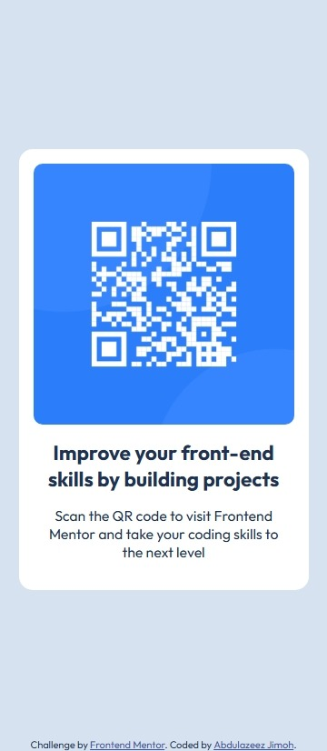
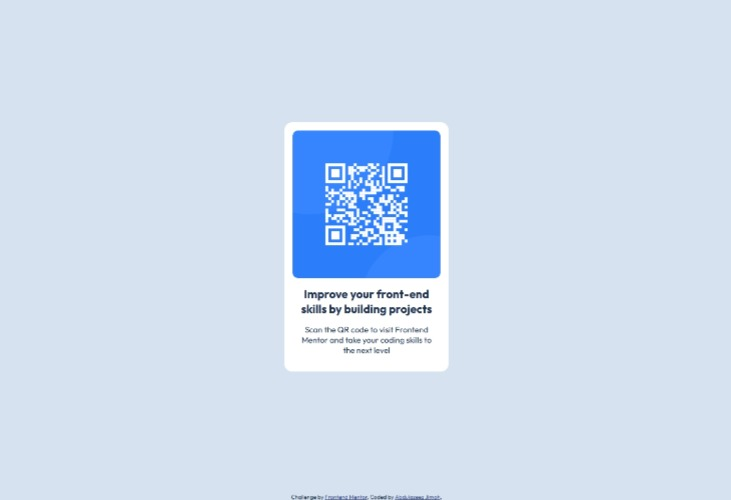

# Frontend Mentor - QR code component


A simple, responsive implementation of the "QR code component" challenge from Frontend Mentor. This project is a small HTML/CSS exercise that recreates the provided design (mobile-first) using semantic markup and modern CSS features.

Live demo: (add your deployed site URL here)

## Table of contents

- [Overview](#overview)
- [Screenshot](#screenshot)
- [Links](#links)
- [Built with](#built-with)
- [What I learned](#what-i-learned)
- [How to run](#how-to-run)
- [Author](#author)
- [Acknowledgments](#acknowledgments)

## Overview

This repository contains a minimal, accessible implementation of the QR code component found on Frontend Mentor. The layout is mobile-first and uses Flexbox and CSS custom properties for easy theming.

### Screenshot




The `design/` folder contains the original mobile and desktop reference images used for the challenge.

### Links

- Solution (this repo): https://github.com/abdulazeezoj/qr-code-component
- Live site: https://abdulazeezoj.github.io/qr-code-component/

## Built with

- HTML5
- CSS3 (custom properties)
- Mobile-first responsive design
- Google Font: Outfit
- Flexbox

Files of interest

- `index.html` — the markup for the component
- `styles/index.css` — main stylesheet using variables and simple, readable classes
- `images/` — contains `image-qr-code.png` and `favicon-32x32.png`

## What I learned

- Practicing mobile-first layout and centering a card with Flexbox
- Using CSS custom properties for colors, font settings and easy adjustments
- Keeping semantic markup and accessible images (descriptive alt attributes)
- Simple layout that adapts to larger screens while keeping proportions

## How to run

To view the project locally, you can simply open `index.html` in your browser. For a local server (recommended), run one of the following from the project root:

```bash
# Python 3
python3 -m http.server 8000

# then open http://localhost:8000 in your browser
```

Or open `index.html` directly:

```bash
# on most systems you can double-click the file or use
xdg-open index.html
```

## Continued development

- Add a small responsive breakpoint for desktop layout to better match the reference desktop image
- Improve accessibility further by adding better focus styles and keyboard navigation examples

## Author

- GitHub - [@abdulazeezoj](https://github.com/abdulazeezoj)

## Acknowledgments

- Frontend Mentor for the original challenge and design reference: https://www.frontendmentor.io/challenges/qr-code-component-iux_sIO_H
